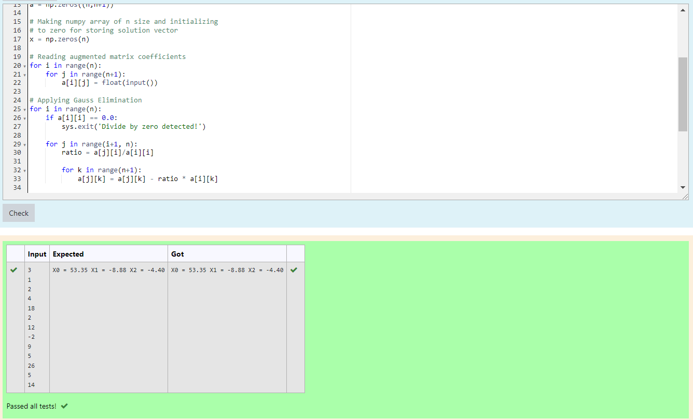

# Gaussian Elimination with partial pivoting

## AIM:
To write a program to find the Gaussian Elimination with partial pivoting of a matrix.

## Equipments Required:
1. Hardware – PCs
2. Anaconda – Python 3.7 Installation / Moodle-Code Runner

## Algorithm
1. Import the numpy module to use the built-in functions for calculation
2. Get the input using n = int(input())
3. The use of a certain equation to eliminate a variable from other equations is called a pivot and a rule we use to choose which equation to use is called a pivoting strategy. The resulting modified algorithm is called Gaussian elimination with partial pivoting
4. End the program

## Program:
```
/*
Program to find the Gaussian Elimination with partial pivoting of a matrix.
Developed by: M VIGNESH
RegisterNumber: 21004061
*/
import numpy as np
import sys

# Reading number of unknowns
n = int(input())

# Making numpy array of n x n+1 size and initializing 
# to zero for storing augmented matrix
a = np.zeros((n,n+1))

# Making numpy array of n size and initializing 
# to zero for storing solution vector
x = np.zeros(n)

# Reading augmented matrix coefficients
for i in range(n):
    for j in range(n+1):
        a[i][j] = float(input())

# Applying Gauss Elimination
for i in range(n):
    if a[i][i] == 0.0:
        sys.exit('Divide by zero detected!')
        
    for j in range(i+1, n):
        ratio = a[j][i]/a[i][i]
        
        for k in range(n+1):
            a[j][k] = a[j][k] - ratio * a[i][k]

# Back Substitution
x[n-1] = a[n-1][n]/a[n-1][n-1]

for i in range(n-2,-1,-1):
    x[i] = a[i][n]
    
    for j in range(i+1,n):
        x[i] = x[i] - a[i][j]*x[j]
    
    x[i] = x[i]/a[i][i]

# Displaying solution
for i in range(n):
    print('X%d = %0.2f' %(i,x[i]), end = ' ')

```

## Output:



## Result:
Thus the program to find the Gaussian Elimination with partial pivoting of a matrix is written and verified using python programming.

